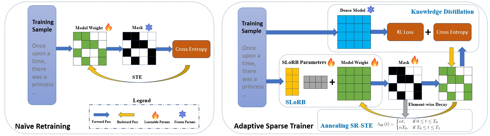

# SparseForge

> **Official code release for the paper _"&lt;PAPER TITLE&gt;"_.**
> Paper: `<ARXIV_LINK>` &nbsp;|&nbsp; Venue: `<VENUE>`

**SparseForge** is a unified training framework for compressing modern Large Language
Models with **semi-structured sparsity** — including **N:M** (2:4) and **block-sparse-16**
patterns — while preserving accuracy close to the dense baseline. It builds on our prior
work [*Adaptive Sparse Trainer*](https://arxiv.org/abs/2407.20584) (AAAI 2025) and extends
it with:

- A **unified** training entry point that supports **LLaMA / OPT / GPT-2 / Qwen / Mistral / DeepSeek-MoE / Hunyuan**.
- **Block-sparse-16** kernels (forward/backward) built on Triton, in addition to the classic 2:4 N:M pattern.
- A **continuous mask** training objective with **Hutchinson Hessian** importance estimation, soft-top-k mask updates, temperature annealing and a scheduled *hardening* phase.
- **SLoRB** (Sparse Low-Rank Bypass) correction modules, Square-head / KL-div / task-loss distillation, and optional FSDP + DeepSpeed sharding for 7B-scale training.



---

## Repository Layout

```
SparseForge/
├── main_llama.py            # Paper entry point: LLaMA-2-7B training
├── main_universal.py        # Paper entry point: universal multi-model training
├── train_llama.sh           # Launcher for main_llama.py (DeepSpeed / torchrun / FSDP)
├── train_universal.sh       # Launcher for main_universal.py
│
├── sparse_modeling.py       # Core: SparseLinear / SparseLinearConfig / Distill_Model
├── triton_block_sparse.py   # Triton kernels for block-sparse-16
├── adamw.py                 # AdamW with decoupled weight decay for masked params
│
├── model.py                 # Base sparse model wrapper
├── model_factory.py         # Auto-dispatch to the correct model adapter
├── model_llama.py           # LLaMA adapter
├── model_qwen.py            # Qwen adapter
├── model_mistral.py         # Mistral adapter
├── model_opt.py             # OPT adapter
├── model_hunyuan.py         # Hunyuan adapter
├── model_deepseek_moe.py    # DeepSeek-MoE adapter
│
├── utils.py                 # Mask computation, Hessian, penalties, data pipeline
├── channel_pruning/         # Structured channel-pruning utilities (used by main_universal)
│
├── eval_wiki_ppl.py/.sh     # WikiText-2 PPL + lm_eval benchmarks
├── evaluate_benchmarks.py   # Zero-shot benchmark runner
├── check_sparsity.py        # Inspect mask sparsity of a checkpoint
│
├── prepare_calibration_data.py
├── prepare_synthetic_calibration.py
├── download_hf_model.py     # HuggingFace model downloader
├── download_wikitext.py     # WikiText-2 downloader
├── download_c4.sh           # C4 downloader
│
├── data/                    # Dataset prep scripts (PIQA, instruct tuning, etc.)
├── configs/                 # DeepSpeed config + hostfile template
├── scripts/                 # Cluster launcher + data preparation helpers
└── assets/                  # Figures
```

---

## Installation

```bash
git clone https://github.com/<org-or-user>/SparseForge.git
cd SparseForge

# 1. PyTorch (adjust the CUDA version to your system)
pip install torch --index-url https://download.pytorch.org/whl/cu121

# 2. Remaining dependencies
pip install -r requirements.txt
```

Tested with PyTorch 2.1+, CUDA 12.1, and 8×H800 / 8×A100 GPUs.

---

## Data Preparation

### C4 (training corpus)

```bash
bash download_c4.sh                 # raw shards
# Per-tokenizer pre-tokenisation (one of the following, depending on the model):
python data/prepare_instruct.py     # instruction-style preprocessing
# or see scripts/prepare_mixed_c4_based.py for per-tokenizer binarization
```

Each tokenizer produces an isolated binary directory (e.g. `data/c4_llama/`,
`data/c4_qwen/`, ...) which is referenced by `--dataset c4_${MODEL_TYPE}`.

### WikiText-2 (evaluation)

```bash
python download_wikitext.py
```

### Pre-trained models

```bash
python download_hf_model.py --repo NousResearch/Llama-2-7b-hf --out models/Llama--Llama2-7b
```

---

## Training

### LLaMA-2-7B (block-sparse-16, Hutchinson Hessian)

```bash
bash train_llama.sh
```

Single-node (default) uses `deepspeed --num_gpus 8`. For multi-node:

```bash
# Edit configs/hosts.txt with your <MASTER_IP> / <WORKER_IP>.
NNODES=2 NODE_RANK=0 MASTER_ADDR=<MASTER_IP> bash train_llama.sh
```

Use `USE_FSDP_FULLY_SHARDED=1 bash train_llama.sh` to train with PyTorch FSDP instead.

### Universal trainer (OPT / Qwen / Mistral / DeepSeek-MoE / Hunyuan / GPT-2)

Open `train_universal.sh` and uncomment the desired model block, e.g.

```bash
STUDENT_MODEL="models/Qwen--Qwen3-1.7b"
TEACHER_MODEL="models/Qwen--Qwen3-1.7b"
MODEL_TYPE="qwen"
MASK_TYPE="block_sparse16"    # or "unstructured" / "structured" (2:4)
```

Then:

```bash
bash train_universal.sh
```

### Key arguments (shared by both entry points)

| Argument | Meaning |
| --- | --- |
| `--mask_type` | `unstructured` / `structured` (2:4) / `block_sparse16` |
| `--hard_mask_type` | Pattern enforced after the hardening phase |
| `--mask_metric` | `hessian_ratio` / `hessian_obd` / `magnitude` / `wanda` |
| `--sparsity_ratio` | Target sparsity (e.g. `0.5`) |
| `--enable_hutchinson` | Use stochastic Hutchinson Hessian for mask scoring |
| `--mask_update_period_before/after` | Mask refresh period across the hardening switch |
| `--mask_hardening_start/duration` | Iterations for continuous→hard mask transition |
| `--SLoRB`, `--SLoRB_k`, `--SLoRB_init_type` | Sparse Low-Rank Bypass module |
| `--distill_model`, `--hardness_task/kldiv/squarehead` | Distillation loss weights |
| `--use_fsdp`, `--fsdp_mode` | `hybrid_shard` / `full_shard` / `none` |

See `main_universal.py --help` for the full list.

---

## Evaluation

```bash
# Evaluate a trained checkpoint on WikiText-2 and zero-shot benchmarks.
CKPT_PATH=outputs/.../model.pt \
MODEL_PATH=models/Qwen--Qwen3-1.7b \
bash eval_wiki_ppl.sh

# Inspect checkpoint sparsity
python check_sparsity.py --ckpt outputs/.../model.pt
```

`eval_wiki_ppl.sh` will optionally run `lm_eval` on `boolq, rte, hellaswag, winogrande,
arc_easy, arc_challenge, openbookqa` with `RUN_LM_EVAL=true`.

---

## Reproducing the Paper

| Table | Entry point | Config |
| --- | --- | --- |
| LLaMA-2-7B 2:4 / block16 | `main_llama.py` via `train_llama.sh` | Defaults in `train_llama.sh` |
| Qwen / Mistral / OPT / DeepSeek-MoE | `main_universal.py` via `train_universal.sh` | Uncomment the relevant `STUDENT_MODEL` block |
| Zero-shot benchmarks | `eval_wiki_ppl.sh` with `RUN_LM_EVAL=true` | — |

Default hyper-parameters in the provided `.sh` scripts match the paper setup.

---

## Citation

If you find SparseForge useful in your research, please cite both the current paper and
the prior Adaptive Sparse Trainer work:

```bibtex
@article{sparseforge2026,
  title   = {<PAPER TITLE>},
  author  = {<AUTHORS>},
  journal = {<VENUE>},
  year    = {<YEAR>},
  url     = {<ARXIV_LINK>}
}

@inproceedings{ast2025,
  title     = {Pruning Large Language Models with Semi-Structural Adaptive Sparse Training},
  author    = {<AUTHORS>},
  booktitle = {AAAI},
  year      = {2025},
  url       = {https://arxiv.org/abs/2407.20584}
}
```

---

## Acknowledgements

SparseForge builds upon [nanoGPT](https://github.com/karpathy/nanoGPT),
[lm-evaluation-harness](https://github.com/EleutherAI/lm-evaluation-harness),
HuggingFace `transformers` / `datasets`, PyTorch FSDP, DeepSpeed and Triton.
We thank the authors and maintainers of these projects.

## License

Released under the [Apache License 2.0](LICENSE).
